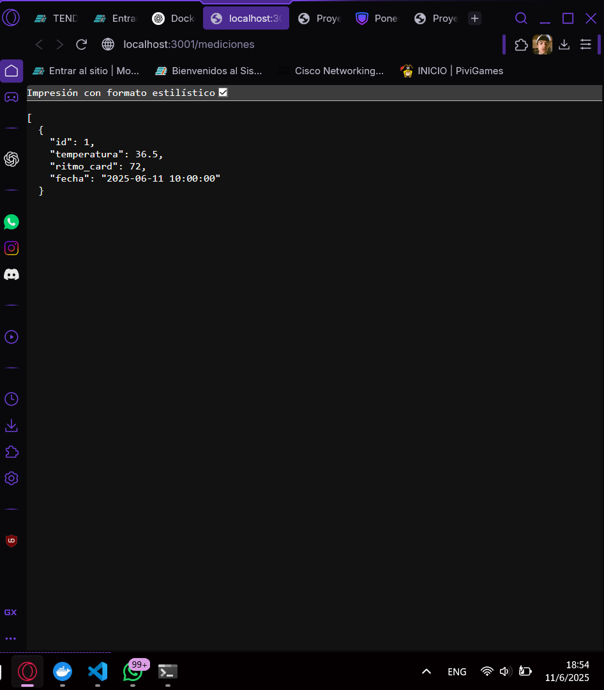
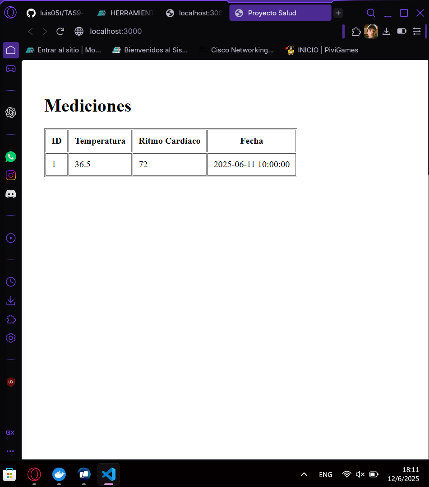
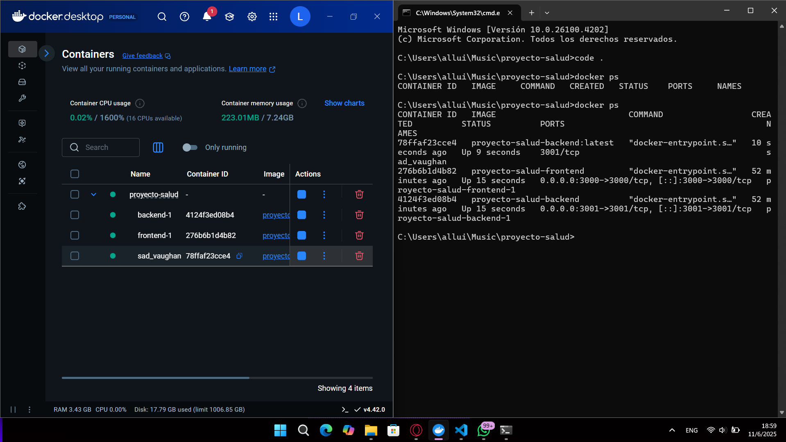
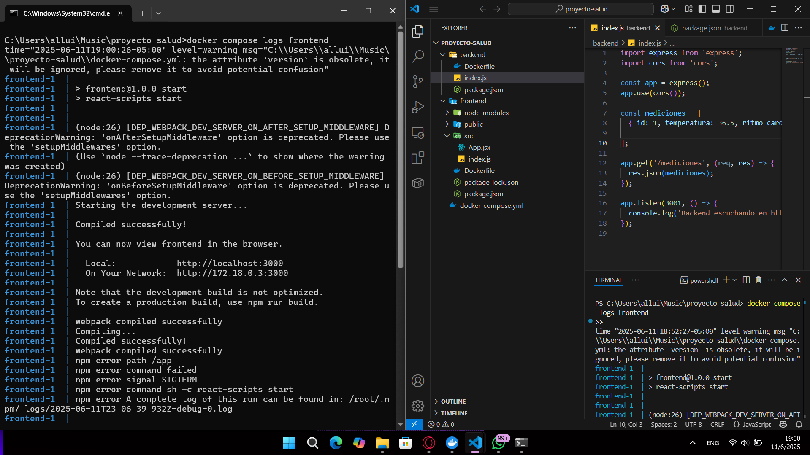

# Contenerización de aplicación frontend React y backend Node.js para visualización de datos de salud mediante API REST

---

## 1. Título  
**Implementación de una aplicación frontend React y backend Node.js para visualización de datos de salud mediante contenerización con Docker y comunicación entre contenedores**

---

## 2. Tiempo de duración  
La práctica se completó en aproximadamente **1 hora y 30 minutos**.

---

## 3. Fundamentos  

En esta práctica se construyeron dos proyectos independientes, uno backend desarrollado en Node.js que expone una API REST para proveer datos de salud, y otro frontend desarrollado en React que consume dicha API y muestra los datos en una tabla. Ambos proyectos fueron contenerizados con Docker y orquestados con Docker Compose para facilitar la comunicación entre contenedores.

### Conceptos clave  
- **API REST**: Interfaz que permite obtener datos mediante peticiones HTTP.  
- **React**: Biblioteca para construir interfaces de usuario dinámicas en frontend.  
- **Node.js con Express**: Entorno y framework para crear servidores backend en JavaScript.  
- **Docker**: Plataforma para contenerizar aplicaciones y sus dependencias.  
- **Docker Compose**: Herramienta para orquestar múltiples contenedores con una configuración sencilla.

---

## 4. Conocimientos previos  
- Conocimientos básicos de JavaScript, React y Node.js.  
- Manejo básico de Docker y Docker Compose.  
- Fundamentos de desarrollo frontend y backend.  
- Comprensión del concepto de API REST.  

---

## 5. Objetivos a alcanzar  
1. Construir un backend en Node.js que exponga una API REST con datos de mediciones de salud.  
2. Construir un frontend en React que consuma la API REST y despliegue los datos en una tabla.  
3. Contenerizar ambos proyectos usando Docker.  
4. Orquestar la comunicación y ejecución simultánea de ambos contenedores con Docker Compose.  

---

## 6. Equipo necesario  
- Sistema operativo con Docker y Docker Compose instalados.  
- Editor de texto o IDE (VS Code recomendado).  
- Navegador para probar la aplicación frontend.  

---

## 7. Material de apoyo  
- **Docker Docs**: https://docs.docker.com/  
- **React Docs**: https://reactjs.org/docs/getting-started.html  
- **Express Docs**: https://expressjs.com/  
- **Docker Compose Docs**: https://docs.docker.com/compose/  

---

## 8. Procedimiento  

### Parte 1: Construcción del backend Node.js  

1. Crear la carpeta del backend y el archivo `package.json` con dependencias básicas:

```
mkdir backend
cd backend
npm init -y
npm install express cors
```

#### Parte 2: Crear archivo index.js con el servidor Express:
```
const express = require('express');
const cors = require('cors');
const app = express();
const port = 3001;

app.use(cors());

const mediciones = [
  { id: 1, temperatura: 36.5, ritmo_cardiaco: 70, fecha: "2025-06-10" }
];

app.get('/mediciones', (req, res) => {
  res.json(mediciones);
});

app.listen(port, () => {
  console.log(`Backend escuchando en http://localhost:${port}`);
});

```

#### Parte 3: Crear el Dockerfile para el backend:
```
FROM node:18

WORKDIR /app

COPY package*.json ./
RUN npm install

COPY . .

EXPOSE 3001

CMD ["node", "index.js"]


```
#### Parte 4 Construcción del frontend React 
- Crear proyecto React (fuera de la carpeta backend):
```
npx create-react-app frontend
cd frontend
npm install

```

#### Parte 5: Editar src/App.js para consumir la API backend y mostrar la tabla:
```
import React, { useEffect, useState } from 'react';

function App() {
  const [mediciones, setMediciones] = useState([]);

  useEffect(() => {
    fetch('http://backend:3001/mediciones')
      .then(res => res.json())
      .then(data => setMediciones(data))
      .catch(err => console.error(err));
  }, []);

  return (
    <div>
      <h1>Mediciones de Salud</h1>
      <table border="1">
        <thead>
          <tr>
            <th>ID</th>
            <th>Temperatura</th>
            <th>Ritmo Cardiaco</th>
            <th>Fecha</th>
          </tr>
        </thead>
        <tbody>
          {mediciones.map(med => (
            <tr key={med.id}>
              <td>{med.id}</td>
              <td>{med.temperatura}</td>
              <td>{med.ritmo_cardiaco}</td>
              <td>{med.fecha}</td>
            </tr>
          ))}
        </tbody>
      </table>
    </div>
  );
}

export default App;


```
#### Parte 6: Crear Dockerfile para el frontend:


```
dFROM node:18

WORKDIR /app

COPY package*.json ./
RUN npm install

COPY . .

EXPOSE 3000

CMD ["npm", "start"]
```
#### Parte 7: Orquestación con Docker Compose.
- Crear archivo docker-compose.yml en la raíz del proyecto (misma carpeta que backend y frontend):
```
version: '3.8'

services:
  backend:
    build: ./backend
    ports:
      - "3001:3001"
    networks:
      - salud-net

  frontend:
    build: ./frontend
    ports:
      - "3000:3000"
    depends_on:
      - backend
    networks:
      - salud-net

networks:
  salud-net:

```

#### Parte 8: Levantar los contenedores y verificar funcionamiento
- Desde la raíz del proyecto, ejecutar:
```
docker-compose up --build

```
- Verificar que el backend corre en http://localhost:3001/mediciones (puedes probar con navegador o Postman).

- Verificar que el frontend corre en http://localhost:3002 y muestra la tabla con los datos consumidos del backend.
## 9. Resultados esperados
A continuación, se presentan los resultados optenidos:
- 1. Backend responde con datos JSON simulados
Esto significa que:

El contenedor del backend (Node.js) está funcionando correctamente.

Cuando se hace una solicitud HTTP GET al endpoint (por ejemplo, http://localhost:3001/mediciones), el backend devuelve un conjunto de datos simulados en formato JSON (texto estructurado que representa los datos).



-  2. Frontend muestra correctamente la tabla con los datos recibidos
Esto indica que:

El contenedor del frontend (React) está corriendo sin errores.

El frontend hace correctamente una solicitud fetch() al backend, obtiene el JSON, y lo transforma en una tabla HTML visible.

Esta tabla contiene columnas como: ID, temperatura, ritmo cardíaco y fecha.

Lo esperado es ver visualmente en el navegador (en http://localhost:3002) una tabla estructurada con los datos provenientes del backend, no datos vacíos ni errores de carga.




- 3. Contenedores están activos y comunicados en la red Docker definida
Aquí se verifica que:

Ambos servicios (backend y frontend) están contenidos por Docker, en ejecución y visibles con docker ps.

Están conectados dentro de la misma red definida en docker-compose.yml (por ejemplo, red_backend o proyecto-salud_default).

Esto asegura que el frontend puede acceder al backend por su nombre de servicio (backend:3001) gracias a la red interna de Docker.




- 4. No se presentan errores de conexión o archivos faltantes
Esto implica que:

No hay errores en consola del tipo:

fetch error en el frontend.

ECONNREFUSED (conexión rechazada) al acceder al backend.

Could not find a required file como ocurrió antes cuando faltaba index.js.

Todo el código necesario fue incluido correctamente en las carpetas del proyecto (src, Dockerfile, package.json, etc).

La ejecución con docker-compose up no genera salidas de error y todos los servicios arrancan exitosamente.




### 10. Audio
Link: https://voca.ro/1h7xSxpgNAFc
### 11 Bibliografia

- Docker Documentation. https://docs.docker.com/

- PostgreSQL Docs. https://www.postgresql.org/docs/

- pgAdmin Docs. https://www.pgadmin.org/docs/

- Docker Multi-stage. https://docs.docker.com/develop/develop-images/multistage-build/
